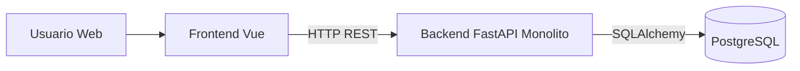
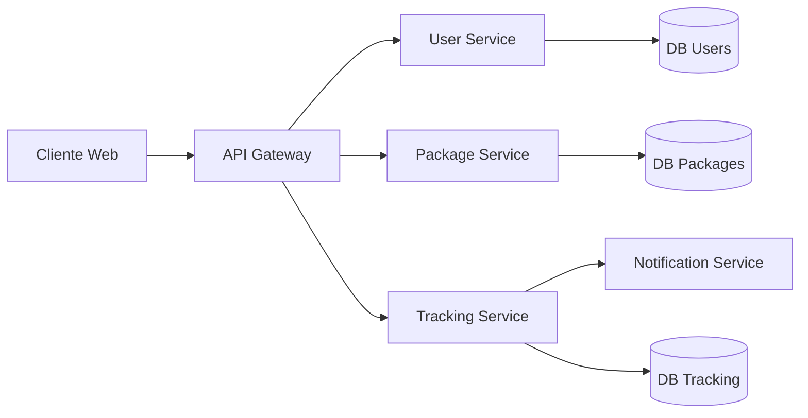
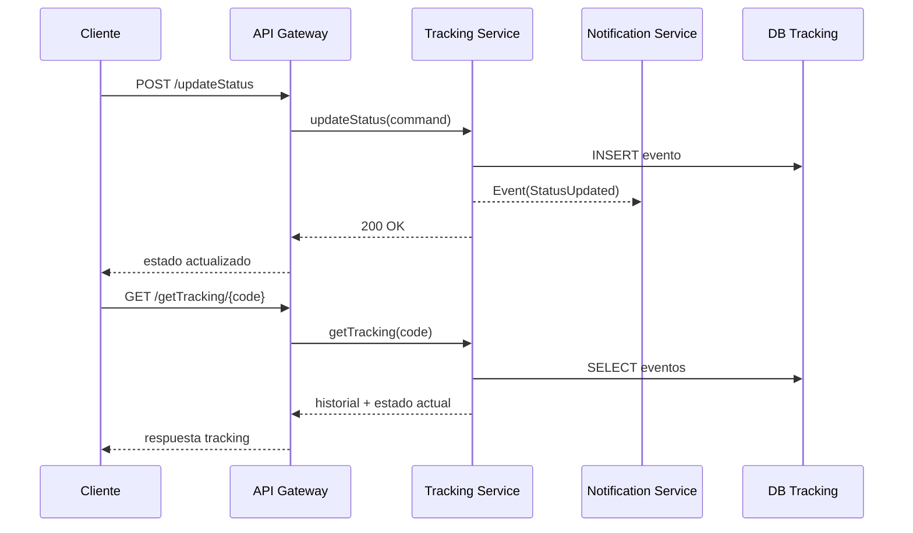

# Migracion de Monolito a Microservicios
## Informe Tecnico Hito 1

**Nombre del Proyecto:** Sistema de Tracking de Paquetes  
**Integrantes:** Completar nombres del equipo  
**Profesor:** Completar nombre del profesor  
**Fecha:** 02 de abril de 2026

## Indice
1. Introduccion
2. Descripcion del Sistema
   1. Contexto General
   2. Alcance
3. Analisis Arquitectonico AS-IS
   1. Descripcion de la Arquitectura Actual
   2. Requerimientos
      1. Requerimientos Funcionales
      2. Requerimientos No Funcionales
   3. Problemas Identificados
   4. Diagramas AS-IS
4. Diseno Arquitectonico TO-BE
   1. Estrategia de Migracion
   2. Definicion de Microservicios
   3. Arquitectura General
   4. Comunicacion entre Servicios
   5. Diagrama de Secuencia
5. Patrones Arquitectonicos
   1. API Gateway
   2. Saga Pattern
   3. Circuit Breaker
   4. Strangler Pattern
6. Implementacion Tecnica
   1. Arquitectura de Despliegue
   2. Docker Compose
   3. Base de Datos
7. Observabilidad
   1. Herramientas Utilizadas
   2. Metricas
   3. Dashboards
   4. Analisis de Metricas
   5. Estimacion de Costos
   6. Analisis
8. Trade-offs
9. Conclusiones
10. Referencias

---

## 1. Introduccion
Este proyecto aborda un sistema de tracking de paquetes implementado actualmente como monolito (backend FastAPI + frontend Vue + PostgreSQL). El objetivo del hito es analizar la arquitectura actual (AS-IS), identificar riesgos tecnicos y definir una propuesta de migracion a microservicios (TO-BE) que mejore mantenibilidad, escalabilidad y resiliencia.

El proposito de la migracion es desacoplar responsabilidades de negocio (usuarios, paquetes, tracking, notificaciones y consulta) y habilitar evolucion independiente por dominio.

## 2. Descripcion del Sistema
### 2.1. Contexto General
El dominio del sistema es logistica de ultima milla y trazabilidad de envios. La plataforma permite:
- Registrar usuarios.
- Crear paquetes asociados a usuarios.
- Registrar cambios de estado de cada envio.
- Consultar estado actual e historial por tracking code.

El modelo actual guarda eventos de tracking en una tabla denormalizada, donde el estado actual se obtiene como el ultimo evento registrado para un tracking code.

### 2.2. Alcance
**Incluye:**
- Interfaz web simple para flujos principales.
- Despliegue por contenedores con Docker.
- Creacion y consulta de usuarios.
- Creacion de paquetes.
- Actualizacion de estado del paquete.
- Consulta de tracking por codigo.

**Endpoints del alcance actual:**
- `POST /createUser`
- `GET /getUsers`
- `POST /createPackage`
- `GET /getAllPackages`
- `POST /updateStatus`
- `GET /getTracking/{tracking_code}`

**No incluye (fuera de alcance actual):**
- Autenticacion/autorizacion.
- Orquestacion de notificaciones reales (email/SMS/push).
- Migraciones DB formales.
- Pruebas automatizadas.
- Observabilidad robusta con dashboards operativos productivos.

## 3. Analisis Arquitectonico AS-IS
### 3.1. Descripcion de la Arquitectura Actual
Arquitectura actual de 3 capas logicas, con backend monolitico:
- **Frontend:** Vue 3 (App.vue) con llamadas directas a HTTP.
- **Backend:** FastAPI con toda la logica concentrada en un unico modulo principal.
- **Persistencia:** PostgreSQL con esquema simple y denormalizado.
- **Despliegue:** Docker Compose con 3 servicios (`frontend`, `backend`, `postgres`).

Caracteristicas AS-IS:
- Alto acoplamiento entre capa API, reglas de negocio y acceso a datos.
- Manejo manual y repetido de validaciones y errores.
- Dependencia de una unica base de datos para todo el dominio.

### 3.2. Requerimientos
#### 3.2.1. Requerimientos Funcionales
- **RF1:** Registrar usuarios con nombre y correo.
- **RF2:** Listar usuarios registrados.
- **RF3:** Crear paquetes asociados a un usuario.
- **RF4:** Registrar cambios de estado por tracking code.
- **RF5:** Consultar historial de tracking por codigo.
- **RF6:** Obtener estado agregado de paquetes.
- **RF7:** Exponer endpoint de salud y metrica basica.

#### 3.2.2. Requerimientos No Funcionales
- **RNF1 (Despliegue):** 
- **RNF2 (Persistencia):** Datos de tracking deben persistir en PostgreSQL.
- **RNF3 (Disponibilidad basica):** Endpoint de healthcheck para validacion operativa minima.
- **RNF4 (Mantenibilidad):** La arquitectura debe permitir evolucion futura a microservicios.
- **RNF5 (Escalabilidad):** Debe soportar crecimiento de volumen de consultas de tracking.

### 3.3. Problemas Identificados
**Deuda tecnica:**
- Monolito con logica de negocio, API y DB en un solo archivo principal.
- Duplicacion de parseo/validacion de requests.
- Manejo generico de excepciones sin trazabilidad.
- Esquema de datos denormalizado y sin relaciones fuertes.

**Acoplamientos criticos:**
- Endpoints acoplados directamente a SQLAlchemy Session.
- Notificacion implementada con `print` dentro del flujo transaccional.
- Frontend acoplado a URLs fijas (`http://localhost:8000`).

**Cuellos de botella:**
- Backend monolitico en un unico proceso para todos los casos de uso.
- Consultas agregadas en memoria para obtener ultimo estado por codigo.
- Escalado limitado al escalar todo el monolito en bloque.

### 3.4. Diagramas AS-IS
**Figura 1: Arquitectura actual (AS-IS)**

Nota: si el curso exige imagen, exportar este diagrama como `as_is.png`.

## 4. Diseno Arquitectonico TO-BE
### 4.1. Estrategia de Migracion
Se propone aplicar **Strangler Pattern** en fases:
1. Introducir API Gateway como facade estable.
2. Extraer primero capacidades de lectura (consultas de tracking).
3. Extraer luego escritura de estados y paquetes.
4. Mantener coexistencia temporal monolito + nuevos servicios.
5. Retirar endpoints legacy gradualmente.

### 4.2. Definicion de Microservicios
- **Servicio 1: User Service**
  - Responsabilidad: ciclo de vida de usuarios.
  - Datos propios: usuarios.

- **Servicio 2: Package Service**
  - Responsabilidad: alta de paquetes y metadatos.
  - Datos propios: paquetes.

- **Servicio 3: Tracking Service**
  - Responsabilidad: eventos de estado y consultas historicas.
  - Datos propios: eventos de tracking.

- **Servicio 4 (opcional evolutivo): Notification Service**
  - Responsabilidad: enviar notificaciones asincronas por cambios de estado.

### 4.3. Arquitectura General
**Figura 2: Arquitectura de microservicios (TO-BE)**

Nota: si el curso exige imagen, exportar este diagrama como `to_be.png`.

### 4.4. Comunicacion entre Servicios
Se propone un esquema mixto:
- **REST sincrono** para operaciones de consulta y comandos directos (API Gateway -> servicios).
- **Eventos asincronos** para integracion desacoplada (ejemplo: `StatusUpdated` para notificaciones o analitica).

Ventajas:
- REST simplifica trazabilidad funcional.
- Eventos reducen acoplamiento temporal y mejoran extensibilidad.

### 4.5. Diagrama de Secuencia
**Figura 3: Flujo critico (actualizacion de estado y consulta)**

Nota: si el curso exige imagen, exportar este diagrama como `secuencia.png`.

## 5. Patrones Arquitectonicos
### 5.1. API Gateway
**Problema:**
Multiples servicios exponen APIs separadas y generan complejidad para frontend.

**Solucion:**
Introducir un punto unico de entrada para routing, seguridad, versionado y observabilidad transversal.

**Justificacion:**
Reduce acoplamiento cliente-servicio y facilita migracion incremental del monolito.

### 5.2. Saga Pattern
**Problema:**
Operaciones de negocio distribuidas entre servicios no pueden depender de transacciones ACID globales.

**Solucion:**
Implementar sagas coreografiadas por eventos (oquestacion opcional segun complejidad).

**Justificacion:**
Permite consistencia eventual con acciones compensatorias en flujos multi-servicio.

### 5.3. Circuit Breaker
**Problema:**
Una falla en un servicio dependiente puede propagar latencia o timeout en cascada.

**Solucion:**
Aplicar circuit breaker en llamadas remotas criticas (Gateway -> servicios, servicios -> externos).

**Justificacion:**
Aumenta resiliencia y evita degradacion total del sistema por fallas parciales.

### 5.4. Strangler Pattern
**Problema:**
Reescribir todo el monolito de una vez incrementa riesgo y costo.

**Solucion:**
Extraer funcionalidades por dominio de forma gradual, manteniendo compatibilidad temporal.

**Justificacion:**
Minimiza riesgo operativo y habilita validacion continua de cada etapa.

## 6. Implementacion Tecnica
### 6.1. Arquitectura de Despliegue
Estado actual:
- `frontend` (Nginx + build Vue)
- `backend` (Uvicorn + FastAPI)
- `postgres` (PostgreSQL 15)

Estado objetivo (evolutivo):
- `api-gateway`
- `user-service`
- `package-service`
- `tracking-service`
- `notification-service` (opcional)
- Bases por servicio o esquema por dominio

### 6.2. Docker Compose
Compose actual define:
- `postgres`: inicializa DB con credenciales de entorno y volumen persistente.
- `backend`: expone puerto 8000, depende de `postgres` healthy.
- `frontend`: expone puerto 8080, depende de `backend`.

Para TO-BE, se recomienda agregar:
- Red interna dedicada para servicios.
- API Gateway como unico puerto publico para APIs.
- Variables de entorno por servicio y secretos externos.

### 6.3. Base de Datos
Uso actual:
- PostgreSQL unico para todo el dominio.
- Tabla `tracking_data` denormalizada para eventos y atributos repetidos de usuario/paquete.

Uso objetivo:
- Separacion por contexto de dominio (usuarios, paquetes, tracking).
- Evolucion a ownership de datos por microservicio.
- Migraciones formales (ejemplo: Alembic) para trazabilidad de cambios.

## 7. Observabilidad
### 7.1. Herramientas Utilizadas
Estado actual del repositorio:
- Existe endpoint `/metrics`, pero no instrumentacion Prometheus real.
- No existe dashboard Grafana versionado en el proyecto.

Propuesta para el hito:
- Prometheus para scraping de metricas.
- Grafana para visualizacion y dashboards.

### 7.2. Metricas
Metricas objetivo:
- **Latencia:** p95 y p99 por endpoint critico.
- **Throughput:** requests por segundo por servicio.
- **Tasa de errores:** porcentaje de respuestas 4xx/5xx.
- **Uso de recursos:** CPU, RAM y I/O por contenedor.

### 7.3. Dashboards
Dashboard recomendado en Grafana:
- Panel 1: latencia por endpoint (Gateway y Tracking).
- Panel 2: throughput por servicio.
- Panel 3: error rate por servicio.
- Panel 4: CPU/RAM por contenedor.

Nota: si el curso exige imagen, exportar dashboard como `grafana.png`.

### 7.4. Analisis de Metricas
Interpretacion esperada:
- El monolito presenta latencia creciente cuando sube concurrencia en endpoints de tracking.
- En TO-BE, la carga de lectura se concentra en Tracking Service, permitiendo escalarlo de forma independiente.
- El error rate debe bajar al agregar circuit breakers y politicas de retry controladas.

### 7.5. Estimacion de Costos
Estimacion cualitativa (hito academico):

| Concepto | Monolito | Microservicios |
|---|---|---|
| Infraestructura | Baja | Media/Alta |
| Escalabilidad | Limitada | Alta |
| Operacion | Simple | Compleja |

Estimacion referencial mensual (ambiente pequeno):
- Monolito: 1-2 instancias de app + 1 DB administrada o contenedor.
- Microservicios: multiples instancias por servicio + gateway + observabilidad.

### 7.6. Analisis
Diferencias de costo:
- **Monolito:** menor costo inicial y operacion simple.
- **Microservicios:** mayor costo de infraestructura/operacion, pero mejor escalado por dominio y mayor resiliencia.

Decision recomendada:
- Mantener monolito para etapas tempranas.
- Migrar gradualmente cuando existan cuellos de botella reales, crecimiento de equipo o necesidades de disponibilidad estricta.

## 8. Trade-offs
**Beneficios de microservicios:**
- Escalado independiente por dominio.
- Despliegue desacoplado por equipo.
- Mejor resiliencia ante fallas parciales.

**Desventajas:**
- Mayor complejidad operacional (red, tracing, observabilidad, seguridad).
- Consistencia distribuida y debugging mas complejos.
- Costos mayores de infraestructura y gobierno tecnico.

**Cuando NO usar microservicios:**
- Equipos pequenos con baja carga.
- Dominio estable y simple.
- Restricciones fuertes de presupuesto/operacion.

## 9. Conclusiones
El sistema actual cumple el objetivo funcional minimo para tracking de paquetes, pero presenta deuda tecnica significativa por alto acoplamiento y falta de separacion de responsabilidades. La migracion propuesta a microservicios debe ejecutarse de forma incremental con Strangler Pattern, priorizando el desacople de lectura/escritura de tracking y la introduccion de un API Gateway.

El enfoque recomendado equilibra riesgo, costo y valor: primero estabilizar arquitectura y observabilidad, luego extraer servicios por dominio con metricas que justifiquen cada paso.

## 10. Referencias
- FastAPI Documentation: https://fastapi.tiangolo.com/
- SQLAlchemy Documentation: https://docs.sqlalchemy.org/
- Docker Compose Documentation: https://docs.docker.com/compose/
- PostgreSQL Documentation: https://www.postgresql.org/docs/
- Martin Fowler - Strangler Fig Pattern: https://martinfowler.com/bliki/StranglerFigApplication.html
- Chris Richardson - Saga Pattern: https://microservices.io/patterns/data/saga.html
- Nygard - Circuit Breaker Pattern (Release It!)
